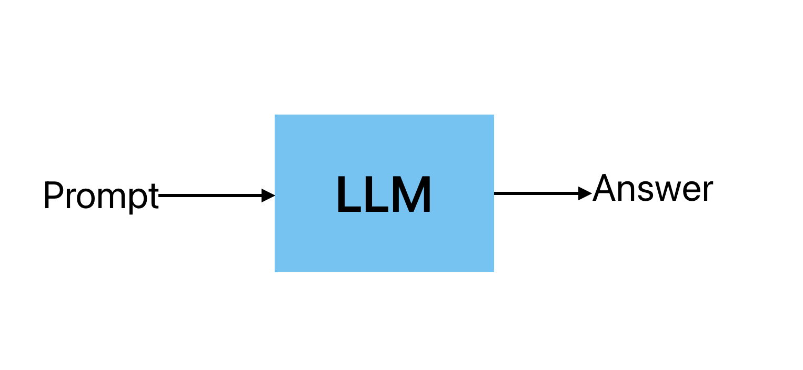
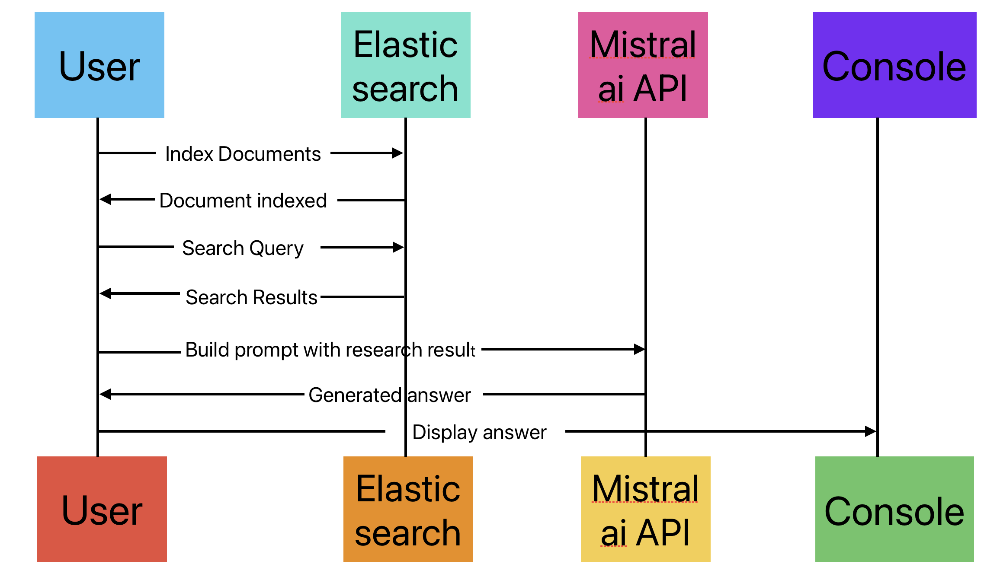

# Table of contents
- [Table of contents](#table-of-contents)
  - [Introduction to LLM and RAG](#introduction-to-llm-and-rag)
  - [What are LLMs?](#what-are-llms)
  - [What is RAG?](#what-is-rag)
  - [RAG Architecture](#rag-architecture)
  - [RAG Pipeline](#rag-pipeline)
- [Preparing the Environment](#preparing-the-environment)
  - [Installing Libraries](#installing-libraries)
  - [Setting Up Jupyter Notebook](#setting-up-jupyter-notebook)
- [Retrieval with MinSearch](#retrieval-with-minsearch)
  - [Introduction to MinSearch](#introduction-to-minsearch)
  - [Understanding TF-IDF and Cosine Similarity](#understanding-tf-idf-and-cosine-similarity)
  - [Indexing Documents](#indexing-documents)
  - [Performing Searches](#performing-searches)
- [Use mistral al for generation using the retreived-augmented prompt](#use-mistral-al-for-generation-using-the-retreived-augmented-prompt)
  - [Introduction to MistralAI](#introduction-to-mistralai)
  - [Biulding prompts](#biulding-prompts)
  - [Generating the response](#generating-the-response)
  - [Using Elastic search for indexing and searching documents](#using-elastic-search-for-indexing-and-searching-documents)
- [Searching with Elasticsearch](#searching-with-elasticsearch)
  - [Setting Up Elasticsearch](#setting-up-elasticsearch)
  - [Running Elasticsearch with Docker](#running-elasticsearch-with-docker)
  - [Remove the Existing Container](#remove-the-existing-container)
  - [Indexing Documents](#indexing-documents-1)
  - [Index Settings and Mappings](#index-settings-and-mappings)
  - [Performing Searches](#performing-searches-1)
  - [Search Query](#search-query)
  - [Integrating Elasticsearch with OpenAI API](#integrating-elasticsearch-with-openai-api)

## Introduction to LLM and RAG

This chapter provides an overview of LLM (Language Learning Models) and RAG (Relevance-Aware Generation). We will explore their architecture, use cases, and the expected outcomes of this course.

## What are LLMs?

LLMs are advanced machine learning models that are trained on large amounts of text data. They possess the capability to comprehend and generate text that resembles human language. This makes them highly valuable for various applications, including chatbots and content generation.

Let's start by focusing on language models. These models predict the next word or token based on the words already present in the document. For instance, when you type a message on your phone, the predictive text feature suggests the most likely next word based on your previous input. This personalized prediction is made possible by language models, which are typically simple and have a limited number of parameters.



## What is RAG?

RAG is a powerful technique that combines retrieval-based methods with generative models. It leverages the retrieval of relevant documents or information to generate highly accurate and contextually relevant responses. This approach enhances the overall effectiveness of the system by incorporating both retrieval and generation capabilities.

## RAG Architecture

The RAG architecture consists of two main components:

- Retriever: This component retrieves relevant documents or information based on the input query.
- Generator: This component generates a response using the retrieved documents as context.

By combining these two components, RAG can provide more accurate and informative responses compared to traditional generative models.

## RAG Pipeline
This is how a typical RAG pipeline works:

- Query: The user inputs a query.
- Retriever: The query is sent to the retriever component.
- Retrieve Documents: The retriever fetches relevant documents or information based on the query.
- Augment: The retrieved documents are used to augment the query.
- Prompt: The augmented query is sent to the generator component.
- LLM (Large Language Model): The generator uses the augmented query to generate a response.
- Response: The generated response is provided to the user.

# Preparing the Environment

Now, we will set up the environment required for the course - installing necessary libraries and tools.

## Installing Libraries

To get started, we need to install the following libraries:

```bash
pip install tqdm notebook==7.1.2 openai elasticsearch pandas scikit-learn
```

## Setting Up Jupyter Notebook

Jupyter Notebook is a popular open-source web application used for creating and sharing documents that combine live code, equations, visualizations, and narrative text. It is widely utilized in the fields of data science and machine learning.

To start Jupyter Notebook, run the following command:

```bash
jupyter notebook
```

To install Anaconda, follow the instructions on the [official website](https://www.anaconda.com/products/distribution).

To install Miniconda, follow the instructions on the [official website](https://docs.conda.io/en/latest/miniconda.html)


# Retrieval with MinSearch

[Video](https://www.youtube.com/watch?v=nMrGK5QgPVE)

[Code](https://github.com/alexeygrigorev/build-your-own-search-engine)

[Code for implementing search minsearch](https://github.com/DataTalksClub/llm-zoomcamp/blob/main/01-intro/minsearch.py)

Now, we will build a simple search engine using the `minsearch` library.

## Introduction to MinSearch

MinSearch is a simple search engine library that allows you to index and search documents using TF-IDF and cosine similarity. It is lightweight, easy to use, and suitable for various applications, such as search engines and recommendation systems.

Minsearch allows you to index documents and perform searches based on TF-IDF and cosine similarity.
Efficient document retrieval is crucial in various applications, from search engines to recommendation systems. 

## Understanding TF-IDF and Cosine Similarity

TF-IDF, which stands for Term Frequency-Inverse Document Frequency, is a numerical statistic that indicates the significance of a word in a document compared to a collection of documents (corpus). It calculates the cosine of the angle between two vectors, representing the similarity between two documents in the context of document retrieval.

## Indexing Documents

MinSearch requires documents to be indexed before searching. This process involves calculating the TF-IDF vectors for each document.

We will load the documents from a JSON file. Each document should have fields that we want to index, such as `question`, `text`, and `section`. Next, we initialize the MinSearch index and fit it with the loaded documents.

```python
import minsearch
import json

with open('documents.json', 'rt') as input_file:
    docs_raw = json.load(input_file)

documents = []

for course_dict in docs_raw: # there are multiple courses
    for doc in course_dict['documents']: # each course has multiple documents
        doc['course'] = course_dict['course'] # add course document to the document list
        documents.append(doc)

index = minsearch.Index(
    text_fields=["question", "text", "section"],
    keyword_fields=["course"]
)

index.fit(documents) # fit the index with the documents
```

In the code snippet above:

- `text_fields` are fields containing the main textual content of the documents.
- `keyword_fields` are fields containing keywords for filtering, such as course names.

## Performing Searches

Once the documents are indexed, we can perform searches using the `search` method.
We start by defining the query we want to search for.

```python
query = 'the course has already started, can I still enroll?'
```

We perform the search by specifying the query and additional parameters like filtering and boosting.

```python
results = index.search(
    query, 
    filter_dict={'course': 'data-engineering-zoomcamp'}, 
    boost_dict={'question': 3.0, 'section': 0.5}, 
    num_results=5
)

print(results)
```

where

- `filter_dict` is used to filter the search results based on keyword fields.
- `boost_dict` is used to give higher importance to certain fields during the search.
- `num_results` specifies the number of top results to return.

The `search` method returns a list of results, each containing the matched document and its relevance score.

```python
for result in results:
    print(f"Document: {result['document']}, Score: {result['score']}")
```


[{'text': "Yes, even if you don't register, you're still eligible to submit the homeworks.\nBe aware, however, that there will be deadlines for turning in the final projects. So don't leave everything for the last minute.", 'section': 'General course-related questions', 'question': 'Course - Can I still join the course after the start date?', 'course': 'data-engineering-zoomcamp'}, {'text': 'Yes, we will keep all the materials after the course finishes, so you can follow the course at your own pace after it finishes.\nYou can also continue looking at the homeworks and continue preparing for the next cohort. I guess you can also start working on your final capstone project.', 'section': 'General course-related questions', 'question': 'Course - Can I follow the course after it finishes?', 'course': 'data-engineering-zoomcamp'}, {'text': "The purpose of this document is to capture frequently asked technical questions\nThe exact day and hour of the course will be 15th Jan 2024 at 17h00. The course will start with the first  “Office Hours'' live.1\nSubscribe to course public Google Calendar (it works from Desktop only).\nRegister before the course starts using this link.\nJoin the course Telegram channel with announcements.\nDon’t forget to register in DataTalks.Club's Slack and join the channel.", 'section': 'General course-related questions', 'question': 'Course - When will the course start?', 'course': 'data-engineering-zoomcamp'}, {'text': 'You can start by installing and setting up all the dependencies and requirements:\nGoogle cloud account\nGoogle Cloud SDK\nPython 3 (installed with Anaconda)\nTerraform\nGit\nLook over the prerequisites and syllabus to see if you are comfortable with these subjects.', 'section': 'General course-related questions', 'question': 'Course - What can I do before the course starts?', 'course': 'data-engineering-zoomcamp'}, {'text': 'Yes, the slack channel remains open and you can ask questions there. But always sDocker containers exit code w search the channel first and second, check the FAQ (this document), most likely all your questions are already answered here.\nYou can also tag the bot @ZoomcampQABot to help you conduct the search, but don’t rely on its answers 100%, it is pretty good though.', 'section': 'General course-related questions', 'question': 'Course - Can I get support if I take the course in the self-paced mode?', 'course': 'data-engineering-zoomcamp'}]


# Use mistral al for generation using the retreived-augmented prompt 

Now we will use mistralai to generate the response using the retrieved documents as context.

The first step is to install the mistralai library:

```bash
pip install mistralai
```

## Introduction to MistralAI
Next we import the `MistralAI` class and create an instance of it.

Mistralai provides powerful APIs for natural language processing tasks.It can be used for various tasks such as generating text, summarizing information, translating languages, and answering questions. We will use it to generate answers based on the search results from our indexed documents. We integrate prompts with RAG to enhance the quality of responses


First sign up to [mistralai](https://mistralai.com/) and create API key.
Save the API key in a .env file

```shell
echo "MISTRAL_API_KEY=your_api_key" > .env
```

## Biulding prompts

A prompt is the input you provide to the LLM to generate a response. It can be a question, a statement, or a set of instructions. The quality and clarity of your prompt directly affect the quality of the response. In general, building effective prompts is crucial for leveraging the full potential of LLMs.

To generate answers, we need to build prompts that provide context to the Mistralai model. Here is an example of how to build a prompt:

```python
def build_prompt(query, search_results):
    prompt_template = """
    You're a course teaching assistant. Answer the QUESTION based on the CONTEXT from the FAQ database.
    Use only the facts from the CONTEXT when answering the QUESTION.

    QUESTION: {question}

    CONTEXT: {context}
    """.strip()

    context = ""
    
    for doc in search_results:
        context = context + f"section: {doc['section']}\nquestion: {doc['question']}\nanswer: {doc['text']}\n\n"
    
    prompt = prompt_template.format(question=query, context=context).strip()
    return prompt
```

To utilize the MistralAI library for generating responses, we need to make some modifications to the existing code.

First, we import the MistralAI library and create an instance of the MistralAI class. This library provides powerful APIs for natural language processing tasks, such as generating text, summarizing information, translating languages, and answering questions.

To build effective prompts, we need to provide context to the MistralAI model. We can achieve this by constructing a prompt that includes the question we want to answer and the relevant information from the search results. This context helps the model generate more accurate and coherent responses.

The build_prompt function takes the `query` (the question we want to answer) and the `search_results` (a list of retrieved documents) as arguments. It follows a template format to construct the final prompt. 

We start by initializing an empty string called `context`. This string will be populated with information from each document in the search results. For each document, we extract the section, question, and text (answer), and format them into a string. We then append this formatted string to the context.

Once the context is complete, we use the format method to insert the query and context into the prompt_template. This process creates the final prompt that will be sent to the MistralAI model for generating the response.

By utilizing MistralAI and constructing well-formed prompts, we can enhance the coherency and understanding of the generated responses. This approach ensures that the responses are concise, relevant, and provide valuable insights to the user.

## Generating the response

Once we have tthe prompt, we can use the MistralAI library to generate the response. We call the `chat` method of the MistralClient class and pass the prompt as input. The model used for generating the response is specified as `open-mistral-7b`.

```python

import mistralai
import os
from dotenv import load_dotenv
from mistralai.client import MistralClient
from mistralai.models.chat_completion import ChatMessage

# Load environment variables from .env file
load_dotenv()

api_key = os.getenv('MISTRAL_API_KEY')
client = MistralClient(api_key=api_key)


def llm(prompt):
    response = client.chat(
        model='open-mistral-7b',
        messages=[
            ChatMessage(role="user", content=prompt)
        ]
    )

    return response.choices[0].message.content

```

Next we execute the function with the prompt and get the response: 

```python
def search(query):
    boost = {'question': 3.0, 'section': 0.5}

    results = index.search(
        query=query,
        filter_dict={'course': 'data-engineering-zoomcamp'},
        boost_dict=boost,
        num_results=5
    )

    return results
```


```python
query = 'how do I run kafka?'
def rag(query):
    search_results = search(query)
    prompt = build_prompt(query, search_results)
    answer = llm(prompt)
    return answer

response = rag(query)

print(response)


rag(query)
```

## Using Elastic search for indexing and searching documents

Now, we will use Elasticsearch to index and search documents. Elasticsearch is a distributed, RESTful search and analytics engine capable of solving a growing number of use cases. It provides a scalable search solution with real-time search capabilities.

[Elastics search](https://www.elastic.co/elasticsearch)

Features:

- **Scalability**: Elasticsearch can scale horizontally to handle large volumes of data across multiple nodes.
- **Real-time Search**: Provides near real-time search capabilities, enabling quick and efficient data retrieval.
- **Distributed Architecture**: Ensures high availability and fault tolerance.
- **Flexible Schema**: Supports dynamic mapping and schema-less document indexing.
- **RESTful API**: Offers a simple and powerful API for interacting with Elasticsearch.
  
# Searching with Elasticsearch

## Setting Up Elasticsearch

Install the ElasticSearch client for Python:

```python
pip install elasticsearch
```

## Running Elasticsearch with Docker

Run Elastic Search 8.4.3 using Docker:
```docker
docker run -it \
    --rm \
    --name elasticsearch \
    -p 9200:9200 \
    -p 9300:9300 \
    -e "discovery.type=single-node" \
    -e "xpack.security.enabled=false" \
    docker.elastic.co/elasticsearch/elasticsearch:8.4.3
    ```

use `-m 4GB \` flag to specify the memory limit for the Docker container.

Use the GET /_cluster/health endpoint to get detailed information about the cluster health, including the status, number of nodes, and number of active shards and the cluster information by running:

```shell
curl -X GET "localhost:9200/_cluster/health?pretty"
curl localhost:9200
```

## Remove the Existing Container

If you get conflict errors, you might need to remove (or rename) that container to be able to reuse that name.

```shell
docker stop elasticsearch
docker rm elasticsearch
```

## Indexing Documents

To index the documents in Elasticsearch, we need to define the index settings and mappings, and then index each document.

## Index Settings and Mappings

First, create an instance of the Elasticsearch client on Jupyter, which connects to the Elasticsearch server. Index settings include configurations such as the number of shards and replicas. Shards help distribute the data and load across the cluster, while replicas provide redundancy for fault tolerance.

We are interested in Mappings that define the structure of the documents within an index. Each field in the documents can have specific data types and properties.

```python
from elasticsearch import Elasticsearch

es_client = Elasticsearch('http://localhost:9200')

index_settings = {
    "settings": {
        "number_of_shards": 1,
        "number_of_replicas": 0
    },
    "mappings": {
        "properties": {
            "text": {"type": "text"},
            "section": {"type": "text"},
            "question": {"type": "text"},
            "course": {"type": "keyword"} 
        }
    }
}

index_name = "course-questions"
es_client.indices.create(index=index_name, body=index_settings)

for doc in documents:
    es_client.index(index=index_name, document=doc)
```

We use the "keyword" type for a field like "course" when we want to filter documents based on the course name or run aggregations to count the number of documents per course.

## Performing Searches

Once the documents are indexed, we can perform searches using Elasticsearch. This section explains how to construct and execute search queries to retrieve relevant documents from the index.

## Search Query

The following example demonstrates how to create a search query in Elasticsearch using the Python client.

```python
query = 'I just discovered the course. Can I still join it?'

def elastic_search(query):
    search_query = {
        "size": 5,
        "query": {
            "bool": {
                "must": {
                    "multi_match": {
                        "query": query,
                        "fields": ["question^3", "text", "section"],
                        "type": "best_fields"
                    }
                },
                "filter": {
                    "term": {
                        "course": "data-engineering-zoomcamp"
                    }
                }
            }
        }
    }

    response = es_client.search(index=index_name, body=search_query)
    result_docs = [hit['_source'] for hit in response['hits']['hits']]
    return result_docs

search_results = elastic_search(query)
print(search_results)

```

The search query in Elasticsearch is composed of several key components that work together to retrieve relevant documents.

- The `size` parameter limits the number of search results to 5, ensuring that the output remains manageable and focused.
- The `multi_match` query searches across multiple fields—specifically `question`, `text`, and `section`—and boosts the relevance of the question field with a factor of 3, making matches in this field more significant.
- The `query` option holds the user's search input, while the `fields` option lists the fields to search in, applying boosting as defined.
- The `type` parameter of the multi_match query is set to best_fields, which finds the single best matching field.
- A `filter` is applied to restrict the search results to documents where the course field equals data-engineering-zoomcamp.

This combination of components ensures that the search results are both relevant and precise, with a specific focus on certain fields and criteria.

## Integrating Elasticsearch with OpenAI API

Finally, we integrate Elasticsearch with the Mistralai API to generate answers based on the search results.

```python
search_results = elastic_search(query)
prompt = build_prompt(query, search_results)
answer = llm(prompt)
print(answer)
```

By integrating Elasticsearch, we can handle larger and more complex datasets, providing a robust and scalable solution for generating answers with the Mistralai API.

