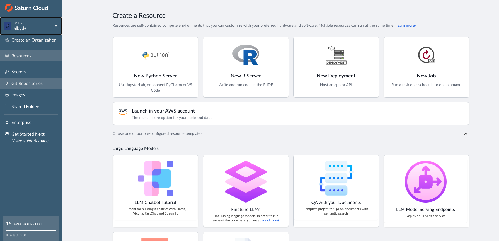

# Setting up the environment using Saturn cloud

- Go to [Saturn Cloud](https://www.saturncloud.io/) and create an account.
- Create a new project and select the option to create a new workspace.
- Select the option to create a new workspace.

Saturn Cloud Interface

## Set up tokens

Generate an SSH keys from Saturn cloud and add it to your GitHub account.

set up a jupyter server in saturn cloud
Install the required libraries : -U transformers accelerate bitsandbytes